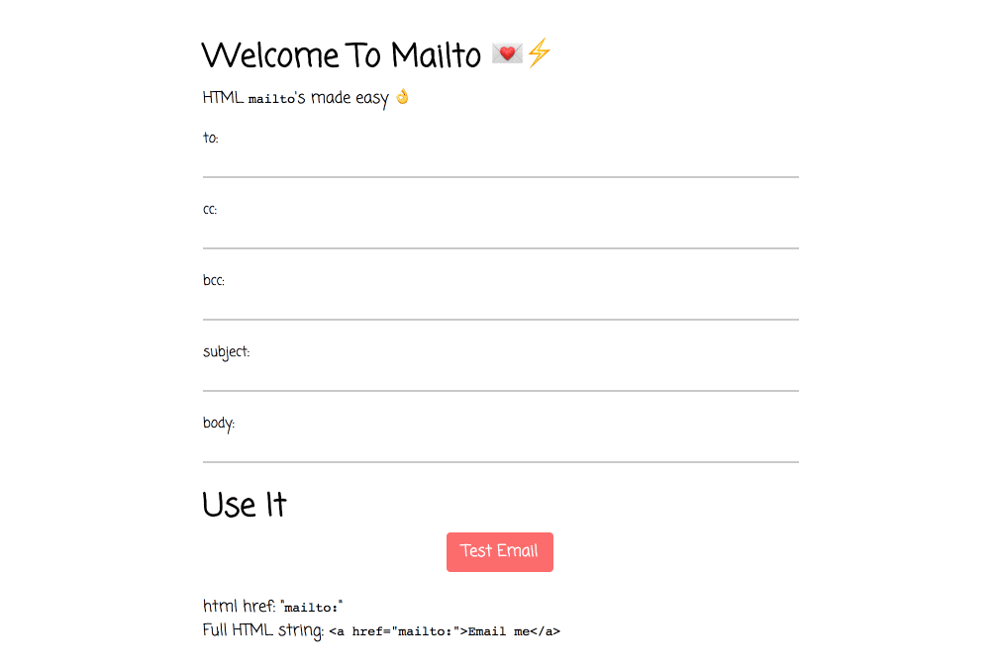

<h1 align="center">
Mailto
💌⚡️
</h1>

 > 💌⚡️ Template full emails in a mailto

 

Mailto is a web app for generating `mailto` `href`'s for use in your web projects.

Use it now at [mailto.now.sh](https://mailto.now.sh)!

## More Information

The mailto protocol lets you create hyperlinks that open the user's default email client with prefilled information.

🎩🐰✨ Anywhere you use that href will automagically create an email with the information prefilled!

Read more about mailto [here](https://www.labnol.org/internet/email/learn-mailto-syntax/6748/).

 

Build using [next](https://github.com/zeit/next.js/) and deployed with [now](https://zeit.co/now)

## License

MIT © [Dawson Botsford](httsp://dawsbot.com)
