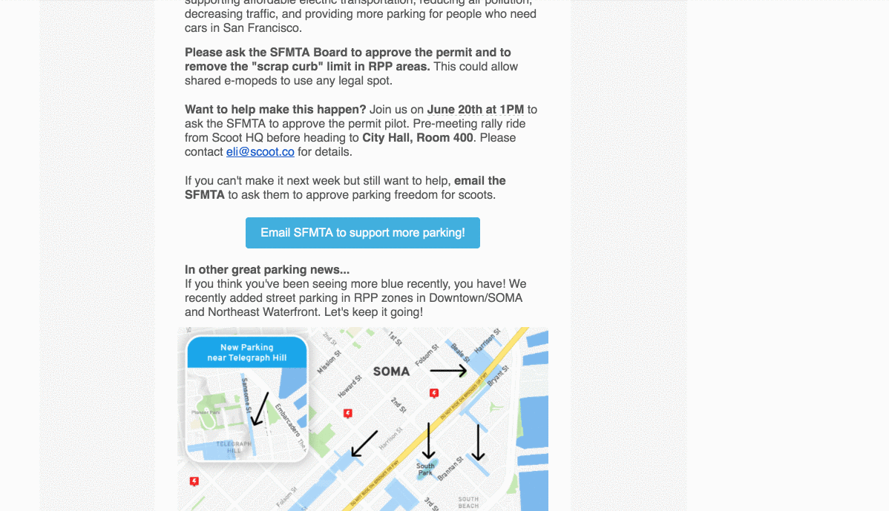

<h1 align="center">
Mailto
💌⚡️
</h1>

 > HTML mailto's made easy 👌

[![Build Status][travis-image]][travis-url]

Engage website visitors with complex email templates. Use `mailto` for creating emails like this:

## Demo

Here's what the web app looks like in action:

After you've entered email information, copy the generated `href` to your clipboard. Anywhere you use that address will automagically create an email with the information preformatted.

Build using [next](https://github.com/zeit/next.js/) and deployed with [now](https://zeit.co/now)

## FAQ

Q: What is `mailto`?

A: The mailto protocol lets you create hyperlinks that will directly launch the default email software and compose a new email message. Read more [here](https://www.labnol.org/internet/email/learn-mailto-syntax/6748/).

## License

MIT © [Dawson Botsford](http://dawsonbotsford.com)

[travis-image]: https://travis-ci.org/dawsbot/mailto.svg?branch=master
[travis-url]: https://travis-ci.org/dawsbot/mailto
