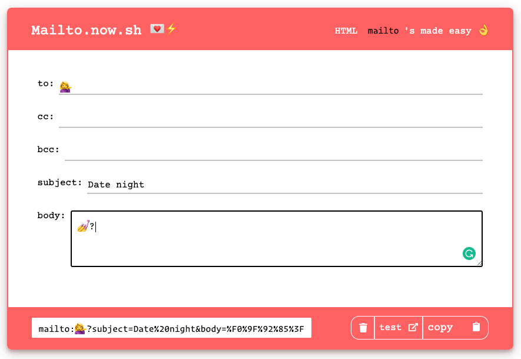
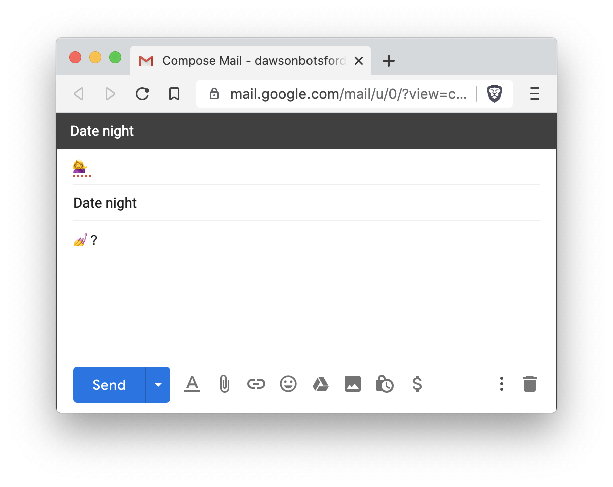

<h1 align="center">
Mailto
💌⚡️
</h1>

> Create mailto's quickly at [mailto.now.sh](https://mailto.now.sh)

 

🙌 Paste your result in `<a href="HERE"` or in your custom `onClick` handler 🙌

 

## More Information

The mailto protocol lets you create hyperlinks that open the user's default email client with prefilled information.

🎩🐰✨ Anywhere you use that href will automagically create an email with the information prefilled!

Read more about mailto [here](https://www.labnol.org/internet/email/learn-mailto-syntax/6748/).

 

## License

MIT ©
